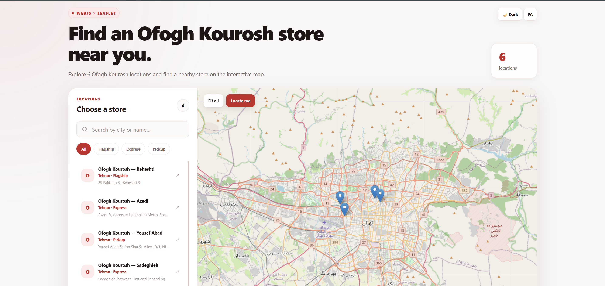

# Ofogh Kourosh Store Locator

A responsive store locator built with WebJs, TypeScript, and Leaflet that allows users to search, filter, and explore Ofogh Kourosh store locations through an interactive map.

Live demo: [Add your deployed project URL here]

## Overview

Ofogh Kourosh Store Locator is a responsive web application designed to help users explore store locations through an interactive map-based interface.

The application uses WebJs for the frontend structure, TypeScript for type-safe development, and Leaflet with OpenStreetMap for interactive maps and location-based features.

The project demonstrates modern frontend development practices including component-based architecture, client-side interactivity, responsive design, filtering, geolocation, theme switching, internationalization, and RTL support.

## Features

* Interactive Leaflet map centered on Tehran

* Display of store locations on the map

* Search stores by name, city, or address

* Filter stores by store type

* Select a store and automatically focus the map on its location

* "Fit all" functionality to display all visible stores

* User geolocation with "Locate me"

* Store information displayed inside map popups

* Responsive and mobile-friendly design

* Light and dark mode

* English and Persian language support

* Automatic RTL layout for Persian

* Persistent language and theme preferences using localStorage

* Modern red-themed user interface

## Tech Stack

### Frontend

* WebJs

* TypeScript

* HTML

* CSS

### Mapping

* Leaflet

* OpenStreetMap

### Additional Features

* Browser Geolocation API

* localStorage

* Responsive CSS

### Deployment

* GitHub

## Screenshots



## Installation

Clone the repository:

```bash
git clone https://github.com/Maryam-Rastin/ofogh-kourosh-store-locator.git
```

Navigate to the project directory:

```bash
cd ofogh-kourosh-store-locator
```

Install dependencies:

```bash
npm install
```

Start the development server:

```bash
npm run dev
```

The application will run locally at the URL provided by the WebJs development server.

## Type Checking

Run the TypeScript check with:

```bash
npm run check
```

This verifies the project's TypeScript code without generating output files.

## Build for Production

Create a production build using the build command configured in the project:

```bash
npm run build
```

The generated production output can then be deployed using the hosting platform or deployment workflow configured for the project.

## Deployment

This project is designed to be hosted as a web application through a compatible deployment platform.

Before deployment, make sure the production build completes successfully:

```bash
npm run build
```

## Project Structure

```text
ofogh-kourosh-store-locator/
├── .github/workflows/     # GitHub Actions workflow(s)
├── .webjs/                # WebJs framework configuration/generated files
├── app/
│   ├── layout.ts          # Global layout and metadata
│   └── page.ts            # Main application page
├── components/
│   └── store-map.ts       # Store locator and Leaflet map component
├── data/
│   └── stores.ts          # Store data and TypeScript types
├── lib/                   # Helpers and assets (e.g. Screenshot.png)
├── public/
│   └── app.css            # Global styles and responsive design
├── .gitignore
├── .nvmrc                 # Node.js version used by the project
├── INSTALL.md             # Detailed installation notes
├── LICENSE                # MIT License
├── README.md              # Project documentation
├── package.json
├── package-lock.json
└── tsconfig.json          # TypeScript configuration
```

## Learning Objectives

This project was built to strengthen skills in:

* WebJs framework fundamentals

* TypeScript and type-safe development

* Component-based architecture

* Leaflet and interactive map integration

* OpenStreetMap integration

* Search and filtering functionality

* Browser geolocation

* Responsive web design

* CSS architecture and theming

* Dark and light mode implementation

* Internationalization

* Persian RTL layout development

* Client-side state persistence with localStorage

* Git and GitHub workflows

## Future Improvements

* Add more store locations across Iran

* Add advanced distance-based store searching

* Display the nearest store automatically

* Add store opening-status indicators

* Add detailed store pages

* Add sorting by distance

* Add route navigation to selected stores

* Add category-specific map markers

* Improve accessibility features

* Add automated tests

## What I Learned

Through this project, I gained practical experience building an interactive location-based web application using WebJs, TypeScript, and Leaflet.

I learned how to integrate third-party mapping libraries, manage interactive map markers, implement search and filtering functionality, work with browser geolocation, create responsive layouts, and build reusable components.

I also gained experience implementing dark mode, language switching, Persian RTL support, persistent user preferences, and integrating OpenStreetMap-based map data into a frontend application.

## Author

**Maryam Rastin**

GitHub: https://github.com/Maryam-Rastin

## License

This project is available under the MIT License.
